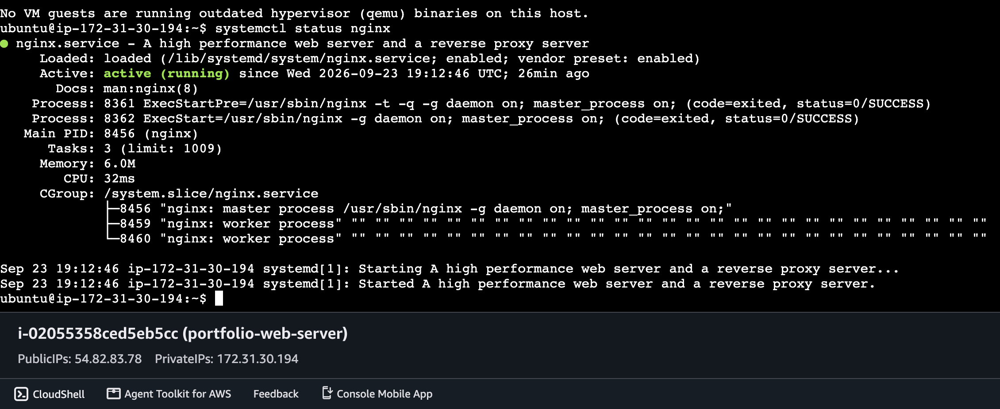
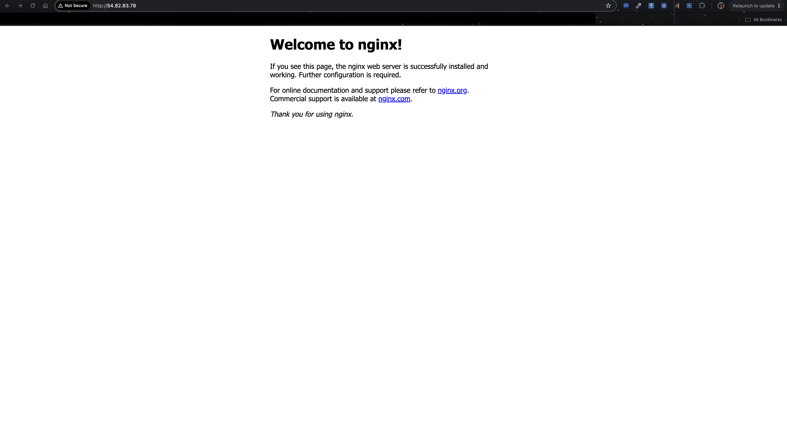
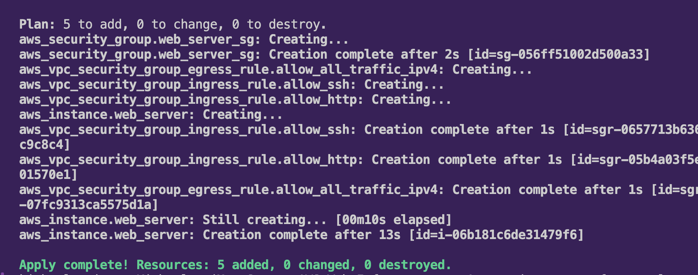
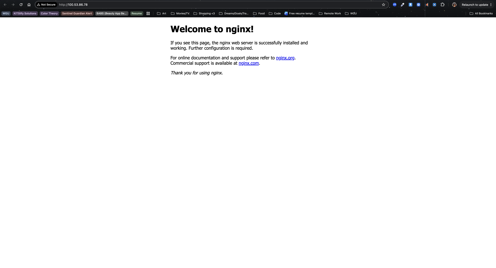
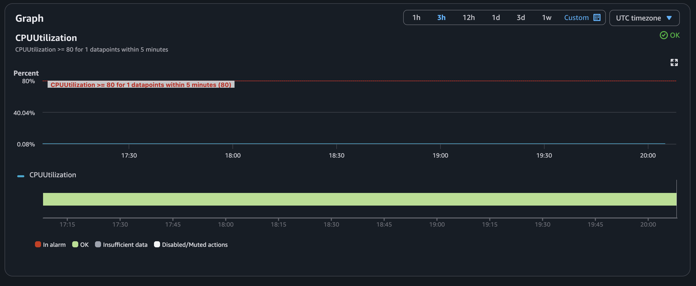
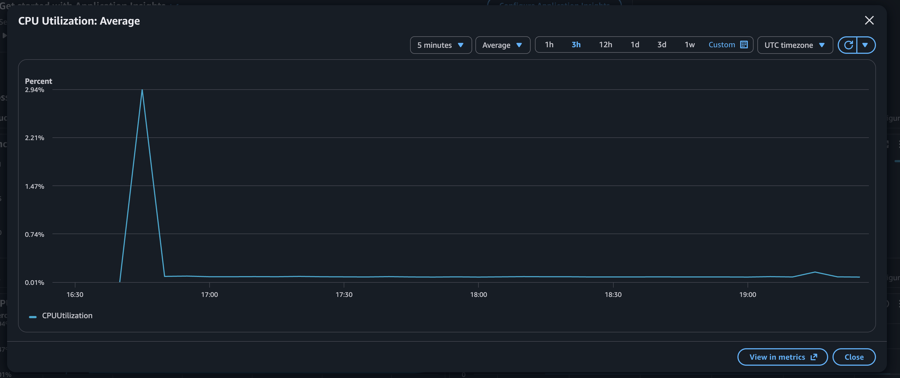
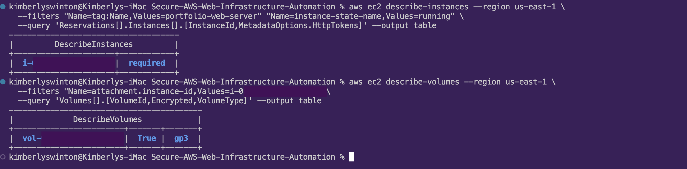
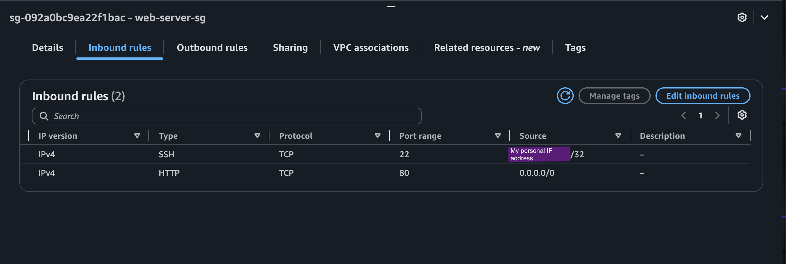

# 🚀 Secure AWS Web Infrastructure Automation v1.0

> **Updated October 2026 after public code review.** I shared this project on Threads and the community dug into my code. They were right about several things. This version fixes the code, corrects the claims, and documents what changed in [Review and Revisions](#review-and-revisions). 🙌🏾

## 👋🏾 Hey there!

I am **SO EXCITED** to share this project! If you know me, you know my favorite place to be is joyfully behind a computer screen, bringing order and reliability to digital chaos ✨

## Project Overview

**The scenario:** A fast-growing B2B SaaS startup (a fictional client for this portfolio project) needs a secure, reliable, monitored web server in the cloud, plus documentation their internal team can use to take over maintenance.

**What I built:** An Ubuntu 22.04 web server on AWS, running Nginx. The server, firewall rules, and IAM permissions are provisioned with Terraform, and the monitoring alarm is documented as a known gap.

**What it is not (yet):** This is a security-conscious baseline, not a fully hardened production system. HTTPS, a dedicated VPC, and monitoring defined in code are on the [roadmap](#known-limitations-and-roadmap).

## Architecture at a Glance

```
Internet
   │  HTTP (port 80) open to everyone
   │  SSH (port 22) allowed from one admin IP only
   ▼
Security Group (web-server-sg)
   ▼
EC2 instance (t3.micro, Ubuntu 22.04, Nginx)
   │  IAM instance profile (role-based permissions, no stored keys)
   ▼
Default VPC in us-east-1
```
## 🛠️ The Tech Stack

I chose these tools for their power and cost-effectiveness:

* **Cloud Provider:** Amazon Web Services (AWS)
* **Infrastructure as Code:** Terraform
* **OS:** Ubuntu Linux 22.04 LTS
* **Web Server:** Nginx (managed via `systemd`)
* **Access and Governance:** AWS Security Groups, IAM role and instance profile
* **Monitoring:** AWS CloudWatch (basic EC2 metrics; see [Known Limitations](#known-limitations-and-roadmap))

## 🔐 Security Posture

Here is exactly what the code does today, and what it does not do yet.

| Control | Status | How it works |
|---|---|---|
| SSH restricted to one admin IP | ✅ In place | `allow_ssh` rule uses `var.admin_cidr`; the real IP lives in a gitignored `terraform.tfvars` |
| Role-based permissions | ✅ In place | Instance profile attached to the server, so no access keys are stored on it |
| IMDSv2 enforced | ✅ In place | `http_tokens = "required"` blocks credential theft through SSRF |
| Encrypted root disk | ✅ In place | `encrypted = true` on a gp3 volume |
| Secrets kept out of Git | ✅ In place | `.gitignore` covers `terraform.tfvars`, state files, and plan files |
| HTTPS (port 443) | ⏳ Roadmap | Port 80 only for now, so traffic is unencrypted |
| Dedicated VPC | ⏳ Roadmap | Runs in the default VPC with a public IP |
| Monitoring defined in code | ⏳ Roadmap | The CloudWatch alarm and SNS email were created by hand |
| CloudWatch Agent (memory metrics) | ⏳ Roadmap | The IAM permissions exist, but the agent is not installed yet |
| Remote Terraform state | ⏳ Roadmap | State is stored locally for this project |

**How I verified it:** after `terraform apply`, I used the AWS CLI to confirm IMDSv2 (`required`) and an encrypted gp3 volume on the live instance, not just in the plan.

## 🏗️ The Build Journey

### Phase 1: Network and Access Controls
I started with the front door. A Security Group acts as the server's firewall, and I wrote it in Terraform so it is reproducible:

* **Port 80 (HTTP):** open to the internet, because this is a public web server
* **Port 22 (SSH):** allowed from one admin IP only, set through a variable (`admin_cidr`)
* **Outbound traffic:** allowed, so the server can download packages

### Phase 2: Manual Server Configuration
Once Terraform created the server, I connected with EC2 Instance Connect and installed Nginx by hand to understand what the automation would later replace:

```bash
sudo apt update
sudo apt install nginx -y
systemctl status nginx
```
***Note:*** At this point SSH was still open to all addresses. After the review I restricted it to my admin IP, which means browser-based Instance Connect no longer reaches the server.

<!-- Screenshots: 02-nginx-service-status.png, 01-nginx-welcome-page.png -->





### Phase 3: Automated Provisioning
Manual steps are slow and easy to get wrong, so I moved them into a `user_data` script inside the Terraform resource. The moment the server boots, AWS updates the package index, installs Nginx, and enables it. Every deployment is identical, with no SSH session needed.

<!-- Screenshots: 04-terraform-apply-success.png, 05-automated-nginx-page.png -->




### Phase 4: Monitoring and Permissions
I created an IAM role and instance profile so the server can talk to CloudWatch without stored credentials. CPU metrics come from EC2's built-in monitoring, and I set up a CPU alarm with an SNS email notification in the console.

**What I learned:** I created the alarm by hand, so it was not part of my Terraform code and `terraform destroy` did not remove it. That gap is called *drift*, and it is the reason monitoring is on the [roadmap](#known-limitations-and-roadmap).

<!-- Screenshots: 06-cloudwatch-dashboard.png, 07-cloudwatch-alarm.png -->




### Phase 5: Hardening After Code Review
After community feedback, I added two more controls and verified them on the live server:

* **IMDSv2 enforced** (`http_tokens = "required"`)
* **Encrypted root volume** (`encrypted = true`, gp3)

<!-- Add redacted verification screenshots here -->

*Live-instance check after apply: `required` confirms IMDSv2, and `True` / `gp3` confirms the encrypted root volume.*

## 🚨 Troubleshooting Log

This is where the fun problem-solving happens! 😅 Each entry follows the same pattern: symptom, investigation, root cause, fix.

<details>
<summary><b>Incident 1: Browser timeout on a healthy web server</b></summary>

**Symptom:** Browsing to the server's public IP returned `ERR_CONNECTION_TIMED_OUT`.

**Investigation:**
1. **Host check:** `systemctl status nginx` showed the service running and listening, so the server itself was healthy.
2. **Firewall check:** The Security Group allowed inbound port 80, so HTTP was permitted.
3. **Reading the error:** A *timeout* means packets were silently dropped. A *connection refused* error would have meant the packets arrived and nothing was listening. That pointed to a firewall, not Nginx.

**Root cause:** My browser tried HTTPS (port 443) first. I had intentionally left port 443 out of the Security Group, so the AWS firewall dropped those packets and the browser waited until it gave up.

**Fix:** Typing `http://` before the IP forced a connection over port 80, and Nginx answered with an HTTP 200.

**Lesson:** Timeout vs. refused tells you where to look next. Timeout points at the network, and refused points at the service.

<table width="100%">
  <tr>
    <th align="center">📸 Inbound rules: port 80 open, no rule for port 443</th>
  </tr>
  <tr>
    <td align="center">
      
    </td>
  </tr>
</table>

*The SSH source is covered in this screenshot for privacy.*

</details>

<details>
<summary><b>Incident 2: Terraform wanted to create everything from scratch</b></summary>

**Symptom:** After editing one security group rule, `terraform plan` reported `8 to add, 0 to change, 0 to destroy` instead of the one in-place change I expected.

**Investigation:**
1. Read the summary line first. Eight additions meant Terraform believed nothing existed.
2. Ran `terraform state list`, which came back empty.

**Root cause:** I had run `terraform destroy` after the earlier work to avoid charges. The state file correctly recorded that nothing existed, so the plan was right and my expectation was wrong.

**Fix:** None needed. I applied the plan, then confirmed the new rule in the AWS console.

**Lesson:** Terraform compares your code to its *state*, not to your memory of what you built. When a plan surprises you, check the state before you touch the code.

</details>

<a id="review-and-revisions"></a>
## 🔍 Review and Revisions

After sharing this project on Threads, the community reviewed my code and gave me honest feedback. I checked every point against my Terraform and README. Some were real gaps in the code, some were places where my README claimed more than the code did. Here is what I found and what I did about it.

### What the review caught

| Finding | What was true | What I did |
|---|---|---|
| SSH open to the whole internet **(Did I freak out? YES!)**| The rule used `0.0.0.0/0` on port 22 | Restricted it to my admin IP using a variable (`admin_cidr`), with the real value in a gitignored `terraform.tfvars` |
| "Hardened" overstated the project | Several hardening controls were missing | Added IMDSv2 enforcement and an encrypted root volume, and reworded the README to claim only what the code does |
| README claimed CloudWatch Agent metrics | `user_data` only installed Nginx, so no agent ran | Removed the claim and added the agent to the roadmap |
| README claimed a dedicated VPC | The code uses the default VPC | Corrected the README and added a dedicated VPC to the roadmap |
| Monitoring was not in the code | The alarm and SNS topic were created by hand | Documented the drift and put monitoring-as-code on the roadmap |
| Screenshots exposed account details | Account ID, VPC ID, and other identifiers were visible | Cropped or redacted the images, and now check every screenshot before I commit it
| Instance family, OS version, and policy style | These are valid upgrades, not errors | Added to the roadmap with the reasoning | 

### How I handled it

1. **Read the feedback without getting defensive.** I treated each comment as a hypothesis to test, not an attack.
2. **Verified before fixing.** I compared each claim to `main.tf` and the live AWS account. Some of what I thought was wrong was fine, and some problems nobody had mentioned showed up along the way.
3. **Fixed the code first, then the docs.** The README now describes the code, not the other way around.
4. **Proved the fixes on the live server.** After applying, I used the AWS CLI to confirm IMDSv2 and disk encryption on the running instance.
5. **Committed in small, named steps.** Each fix has its own commit, so the history shows what changed and why.

### What I learned

* **A README is a set of claims, and every claim can be checked.** If the code does not back a sentence up, it comes out.
* **Hardening is a list of controls, not a label.** I can now name each control and point to the line that implements it.
* **Redaction is part of the job.** Screenshots in public documentation need the same care as code.
* **Drift is real.** Anything created by hand will eventually disagree with the code.

## 🤖 Behind the Scenes: How I Learned This

I built this project with an AI mentor that I designed myself. I wrote a detailed prompt that turned Claude into **Cody Cloud**, a Senior Cloud Engineering Mentor, with strict rules: go one step at a time, explain the *what, how, and why* before any code, teach me to read error logs instead of handing me fixes, and help me document as I go.

**What that looked like in practice:**

* **I did the work.** Every command, edit, commit, and screenshot was mine. Cody explained and reviewed, and I typed.
* **Errors became lessons.** When `terraform plan` said `8 to add`, I did not get a fix. I got a way to read the summary line, check the state, and find the cause myself.
* **Feedback became a plan.** Cody helped me turn public criticism into a checklist and verify each point before changing anything.
* **Documentation stayed in sync.** Notes taken along the way became this README and the runbook.

**Skills I gained:** reading Terraform plans and diffs, debugging with state and CLI checks, hardening EC2 (IMDSv2, encryption at rest), handling secrets and redaction, writing clear Git history, and documenting honestly.

I think using AI this way, as a tutor with rules instead of a shortcut, is a real skill, and I want to be open about it.

<a id="known-limitations-and-roadmap"></a>
## 🗺️ Known Limitations and Roadmap

Nothing here is hidden. These are the gaps I know about, why each one matters, and how I would close it.

| Gap | Why it matters | Planned fix |
|---|---|---|
| No HTTPS | Traffic on port 80 is unencrypted | Add port 443 with a TLS certificate (AWS Certificate Manager behind a load balancer, or Let's Encrypt on the server) |
| Default VPC, public IP | Less network isolation than production needs | Build a dedicated VPC with public and private subnets in Terraform |
| SSH still exists | Any open port is attack surface | Move to AWS Systems Manager Session Manager and remove port 22 entirely |
| Monitoring created by hand | The alarm and SNS topic drift from the code and survive `terraform destroy` | Define `aws_cloudwatch_metric_alarm` and `aws_sns_topic` in Terraform, pointed at the instance |
| CloudWatch Agent not installed | Only basic CPU metrics exist, with no memory data | Install and configure the agent in `user_data` |
| Local Terraform state | One laptop holds the only copy, and teammates cannot share it | Move state to an encrypted S3 backend with locking |
| No CI/CD | Changes are applied by hand | Automate checks and deployment with GitHub Actions (my next project) |
| Instance family and OS age | t3 and Ubuntu 22.04 work, but ARM-based t4g is cheaper and 24.04 LTS has a longer support window | Switch to t4g with a matching arm64 Ubuntu 24.04 AMI |
| IAM trust policy written as JSON | `jsonencode` works but is harder to read and validate | Replace with the `aws_iam_policy_document` data source |
| No host hardening audit | "Hardened" needs evidence beyond a few settings | Run Lynis for a baseline score, fix findings, and automate with Packer |

## 📖 Deployment Runbook

*Use this to build, verify, and tear down the environment. Written so a new teammate can follow it without asking questions.*

### Prerequisites

* [Terraform](https://developer.hashicorp.com/terraform/install) installed
* [AWS CLI](https://docs.aws.amazon.com/cli/latest/userguide/getting-started-install.html) installed and authenticated
* Your public IP address (find it at `checkip.amazonaws.com`)

### Step 1: Confirm you are in the right AWS account

```bash
aws sts get-caller-identity
```

Check that the `Account` value is the one you intend to use. This prevents building in the wrong account.

### Step 2: Create your local variables file

Create a file named `terraform.tfvars` in the project folder:

```hcl
admin_cidr = "YOUR.IP.HERE/32"
```

The `/32` means exactly one address. This file is gitignored, so your IP never reaches GitHub. If it is missing, `terraform plan` will ask you for the value instead.

### Step 3: Initialize, format, and validate

```bash
terraform init
terraform fmt
terraform validate
```

You want `Success! The configuration is valid.`

### Step 4: Preview the changes

```bash
terraform plan
```

Read the summary line at the bottom. A fresh build should say `8 to add, 0 to change, 0 to destroy`. If it says anything will be destroyed that you did not expect, stop and investigate.

### Step 5: Deploy

```bash
terraform apply
```

Review the plan, then type `yes`. Look for `Apply complete! Resources: 8 added, 0 changed, 0 destroyed.`

### Step 6: Verify the deployment

**Web server:** open `http://<public-ip>` in a browser. Type `http://` yourself, because browsers may try HTTPS first and the port is closed on purpose.

**Hardening settings on the live instance:**

```bash
aws ec2 describe-instances --region us-east-1 \
  --filters "Name=tag:Name,Values=portfolio-web-server" "Name=instance-state-name,Values=running" \
  --query 'Reservations[].Instances[].[InstanceId,MetadataOptions.HttpTokens]' --output table
```

Expected: `required`. Copy the instance ID from the first column, then run:

```bash
aws ec2 describe-volumes --region us-east-1 \
  --filters "Name=attachment.instance-id,Values=YOUR-INSTANCE-ID" \
  --query 'Volumes[].[VolumeId,Encrypted,VolumeType]' --output table
```

Expected: `True` and `gp3`.

### Step 7: Tear down

```bash
terraform destroy
```

Type `yes`. Look for `Destroy complete! Resources: 8 destroyed.` Do this when you finish testing so nothing keeps billing.

### Useful inspection commands

| Command | What it does | When to use it |
|---|---|---|
| `terraform state list` | Lists every resource Terraform is tracking | When a plan surprises you |
| `terraform state show <resource>` | Shows what Terraform believes about one resource | To compare state against your code |
| `aws cloudwatch describe-alarms --region us-east-1` | Lists alarms in the account | To find monitoring created by hand |
| `aws sns list-topics --region us-east-1` | Lists SNS topics | Same as above |

### Troubleshooting

| Symptom | Likely cause | What to check |
|---|---|---|
| `ERR_CONNECTION_TIMED_OUT` in the browser | Browser tried HTTPS, and port 443 is closed | Use `http://` explicitly |
| `terraform plan` shows `8 to add` when you expected a change | State is empty, usually after a destroy | Run `terraform state list` |
| `describe-instances` returns an empty table | Instance is still starting, or is in another region | Wait a minute, and check the `--region` value |
| SSH connection times out | Your IP changed since you set `admin_cidr` | Update `terraform.tfvars` and re-apply |
| `Unable to locate credentials` or `ExpiredToken` | AWS CLI is not signed in | Run `aws sts get-caller-identity`, then sign in again |

### Before you commit

```bash
git status
git diff --staged
git ls-files
```

Stage files by name (`git add <filename>`), never `git add .`. Confirm that `terraform.tfvars`, state files, and unredacted screenshots are not in the list.